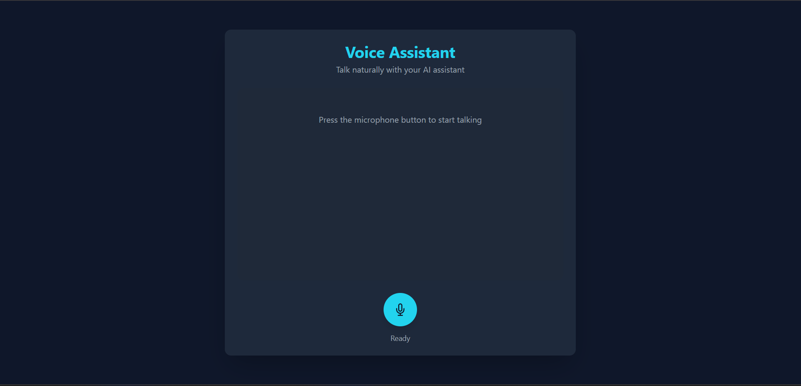

#  AI Voice Agent
30 Days of AI Voice Agents  with Murf AI

## 🚀 Features

- **Voice Interaction**: Natural conversation through microphone input
- **Conversational Memory**: Maintains context across interactions
- **Real-time Processing**: Streamlined STT → LLM → TTS pipeline
- **Responsive UI**: Clean interface with visual feedback

### Backend Services
| Service | Purpose |
|---------|---------|
| FastAPI | Python web framework |
| AssemblyAI | Speech-to-text transcription |
| Google Gemini | Large language model |
| Murf.ai | Text-to-speech synthesis |

### Frontend
- HTML,CSS,JS
- Tailwind CSS


## Deployment

To deploy this project run

```bash
  https://github.com/AbyvargheseMandapathel/Murf-AI
```
Set up Python environment:

```bash
python -m venv venv
source venv/bin/activate  # Linux/Mac
.\venv\Scripts\activate  # Windows
```

Install dependencies:

```bash
pip install -r requirements.txt
```

#🏃‍♂️ Running the Application
Start the development server:

```bash
uvicorn main:app --reload
```


## Environment Variables

To run this project, you will need to add the following environment variables to your .env file

`ASSEMBLYAI_API_KEY`

`MURF_API_KEY`

`GEMINI_API_KEY`


## Screenshots



