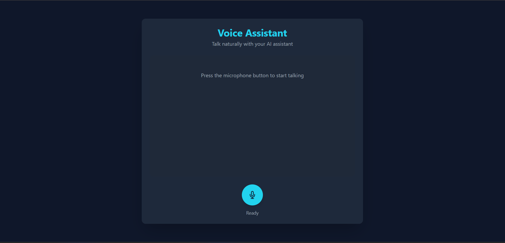

# 🧙‍♂️ Mayavi – The Magical AI Voice Agent

Mayavi is a **real-time voice AI agent** powered by **AssemblyAI**, **Google Gemini**, and **Murf.ai**.
It listens to your speech, understands your intent, and responds back with a whimsical magical personality in natural-sounding voice.

---

## 🚀 Features

* 🎤 **Voice Interaction**: Natural conversation through microphone input
* 🧠 **Conversational Memory**: Maintains context across interactions
* ⚡ **Real-time Processing**: Streamlined **STT → LLM → TTS** pipeline
* 🪄 **Custom Persona**: Mayavi, a mischievous forest imp with a magical tone
* 🔊 **Streaming TTS**: Low-latency, human-like responses using Murf.ai
* 💾 **Session-based Audio Recording**: Saves conversations as `.ogg` files
* 📊 **Responsive UI**: Clean interface with visual feedback
* ⛅ **Weather Integration**: Mayavi can fetch and talk about current weather conditions

---

## 🛠️ Backend Services

| Service           | Purpose                       |
| ----------------- | ----------------------------- |
| **FastAPI**       | Python web framework          |
| **AssemblyAI**    | Speech-to-text transcription  |
| **Google Gemini** | Large language model (LLM)    |
| **Murf.ai**       | Text-to-speech synthesis      |
| **Weather API**   | Get real-time weather updates |

---

## 🎨 Frontend

* HTML, CSS, JS
* Tailwind CSS for styling

---

## 📦 Deployment

Clone the repository:

```bash
git clone https://github.com/AbyvargheseMandapathel/Murf-AI.git
cd Murf-AI
```

Set up Python environment:

```bash
python -m venv venv
source venv/bin/activate  # Linux/Mac
.\venv\Scripts\activate  # Windows
```

Install dependencies:

```bash
pip install -r requirements.txt
```

---

## 🏃‍♂️ Running the Application

Start the development server:

```bash
uvicorn main:app --reload
```

Visit: [http://localhost:8000](http://localhost:8000)

---

## 🔑 Environment Variables

To run this project, you will need to add the following environment variables to your `.env` file:

```
ASSEMBLYAI_API_KEY=your_assemblyai_api_key
MURF_API_KEY=your_murf_api_key
GEMINI_API_KEY=your_google_gemini_api_key
WEATHER_API_KEY=your_weather_api_key
```

---

## 📸 Screenshots



---

## 🌟 What’s Next

* Multi-voice & mood selection
* Customizable persona dashboard
* Cloud deployment for public demos

---

💡 *Mayavi isn’t just a bot — it’s an experience. Built for fun, experimentation, and pushing the boundaries of real-time AI voice agents.*
